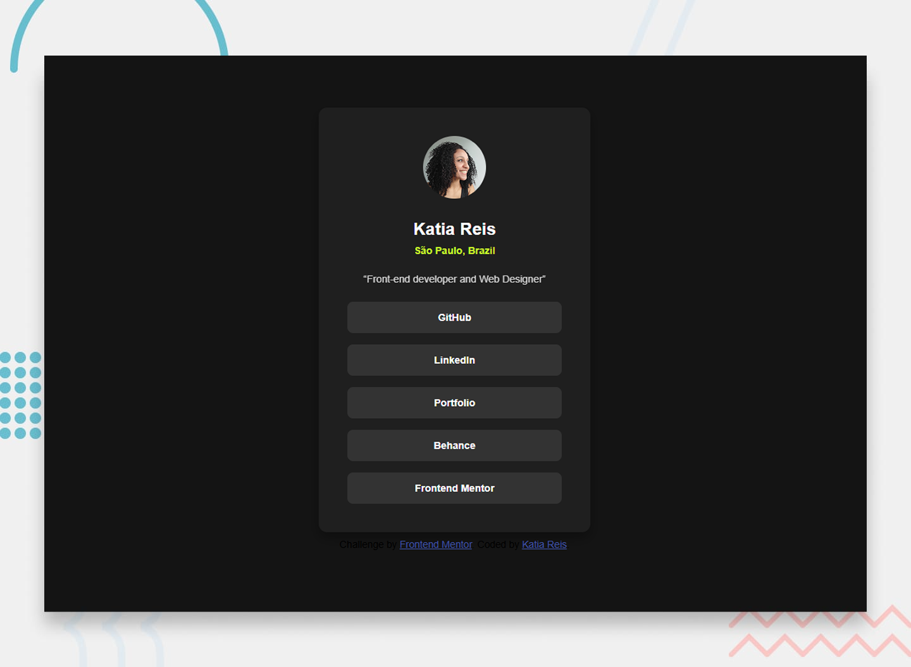

# Frontend Mentor - Social links profile solution

This is a solution to the [Social links profile challenge on Frontend Mentor](https://www.frontendmentor.io/challenges/social-links-profile-UG32l9m6dQ). Frontend Mentor challenges help you improve your coding skills by building realistic projects. 

## Table of contents

- [Overview](#overview)
  - [The challenge](#the-challenge)
  - [Screenshot](#screenshot)
  - [Links](#links)
- [My process](#my-process)
  - [Built with](#built-with)
  - [What I learned](#what-i-learned)
  - [Continued development](#continued-development)
  - [Author](#author)

## Overview

This small project represents a social profile links card (often called a Social Links Profile), a classic project for beginner front-end developers. It is a simple website page developed with HTML and CSS only.

### The challenge

Users should be able to:

- See hover and focus states for all interactive elements on the page.

- Click on all interactive buttons and link on the page.

- Ensure visitors can navigate the links only using their keyboard.

### Screenshot

### Links

- Solution URL: [Social links profile solution](https://devkatiareis.github.io/FrontendMentor-social-links-profile-code-challenge/)
- Project Repo URL: [GitHub Repo](https://github.com/devkatiareis/FrontendMentor-social-links-profile-code-challenge)

## My process

- Analize project structure
- Design Figma Prototype
- Prepare environment in VSCode and GitHub
- Code HTML and CSS structures
- Testing for Desktop and Mobile Devices

### Built with

- Semantic HTML5 markup and SEO
- Responsive CSS custom properties
- Flexbox
- CSS Grid
- Mobile-first workflow

### What I learned

Some of your major learnings while working through this project was trying to create a complete code structured in Semantic HTML5 and CSS3 using modern best practices (such as Flexbox and CSS variables) to reproduce the layout exactly as in the image provided by Frontend Mentor, using the correct elements based on the content.
Train for specificity  by getting your solution to look similar to the design.

### Continued development

I will continue focusing on Semantic HTML and CSS in future projects. I want to improve concepts I am still not completely comfortable with and techniques I found useful, but that I want to refine such as Flexbox and Grid.

## Author

- Website - [Katia Reis](https://www.katiareis.com.br)
- Frontend Mentor - [@katiareis](https://www.frontendmentor.io/profile/devkatiareis)
- Linkedin - [Katia Reis](https://www.linkedin.com/in/katiareis/)
